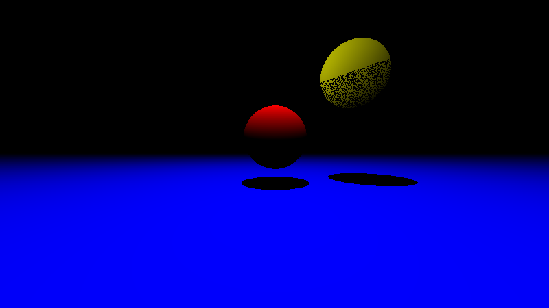

# Python Raytracer & 3D Rendering Experiments

A collection of Python scripts exploring different methods of 3D rendering, from basic raytracing to wireframe projection using various graphics libraries.

## Project Structure

This repository contains several different implementations of 3D rendering:

### 1. Raytracers
- **`raytracer.py`**: A pure Python raytracer that renders a scene containing spheres and planes. It uses the `Pillow` (PIL) library to save the final render as `output.png`. Features include basic lighting, shadows, and a camera system.
- **`raytracer_pygame.py`**: A real-time raytracer implementation using `pygame`. Instead of saving to a file, it renders the scene directly to a window, allowing for interactive or animated raytracing experiments.

### 2. 3D Projection & Wireframes
- **`pygame3d.py`**: A 3D wireframe engine built with `pygame`. It uses `numpy` for matrix transformations (rotation, scaling) and projects 3D coordinates onto a 2D screen to render rotating cubes.
- **`turtle3d.py`**: A similar 3D wireframe implementation but using Python's built-in `turtle` graphics module. It demonstrates 3D projection and rotation using a simpler, more educational graphics backend.

## Requirements

The project uses modern Python (>=3.12) and manages dependencies via `uv`.

### Key Dependencies:
- **NumPy**: Used for efficient matrix operations and vector math in the 3D projection scripts.
- **Pygame**: Used for real-time rendering and window management.
- **Pillow (PIL)**: Used for image creation and saving in the offline raytracer.

## Installation & Usage

If you have `uv` installed, you can run the scripts directly:

```bash
# Run the offline raytracer
uv run raytracer.py

# Run the real-time pygame raytracer
uv run raytracer_pygame.py

# Run the 3D wireframe demo
uv run pygame3d.py
```

Alternatively, install the dependencies manually:

```bash
pip install numpy pygame pillow
```

## Output
The offline raytracer (`raytracer.py`) generates an `output.png` file in the root directory showing the rendered scene.


